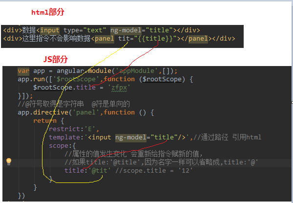

##Angualr自定义指令——directive
###一些概念
1. 指令是不依赖于控制器的
2. 指令默认不会产生作用域 ，也可以手动声明创建作用域
3. 指令的分类: 装饰型（负责添加功能的）,  组件式（替换成一个完整的组件）可以复用
4. 指令的格式
```    
var app= angular.module('appModule',[]);
       app.directive('myDrag',function () {  //ECMA命名规范多个单词以-连接(html)，js中采用驼峰命名--与html中定义的指令呼应
          return { 
              restrict:'ACEM',  //限制使用范围 
              replace:true,     //是否替换外层的原有标签，默认是false
              template:`<div>
                           <h1>HELLO angular</h1>
                           <p>你好</p>
                        </div>`
              //只要涉及到模板替换,外面就要有一个根节点
          }          
```
### 指令中的属性
 - restrict：___限制使用范围___,ACEM 每一个字母代表一种格式，___得大写___。。ACEM分别代表属性，css类(class),元素,注释。**默认**生效的是AE
 - replace：默认是false,是否替换外层的原有标签，要求模板**必须有一个根节点**
 - template：可替换模板字符串
 - templateUrl：可替换模板文件
 - transclude：默认值false，为**true表示保留标签里原有的内容**，嵌入到模板中（模板接收内容的标签需添加**ng-transclud**e指令）
 - link：连接作用域和视图的，**操作dom**
 - scope：创建一个作用域。
 - controller：
 - require：
###  link方法的格式
```
link:function (scope,element,attrs) { 
//scope代表当前指令所在作用域,element代表当前指令所在的元素，代表的是当前指令上的所有属性 
	element.css({'color':'red','font-size':'100px'});
	console.log(attrs);
	scope.title = attrs.title;	
}   
```
### link中的参数
nt是类JQ对象有大部分操作dom的方法，angular中要求数值增加单位px     
- attrs 代表的是当前指令上的所有属性  
- element当前指令所在的元素
- scope代表当前指令所在作用域，若指令没有创建作用域使用的是上一级,若创建了作用域就是指令代表的元素的范围。
###scope属性，创建一个作用域。
 - 值为true时，保留在作用域链上，可以使用父作用域的属性。
 - 值是一个对象，创建一个独立作用域与$rootScope平级。（适合做组件开发）
```
     app.directive('panel',function () {
         return {
             restrict:'E',
             templateUrl:'tmpl/panel.html',
             transclude:true,
             scope:{ 
                 title:'@tit'//有三种接收数据的方式
             },
             /*scope:true*/
             
         }
     })
     
```
### 创建独立scope的指令动态引用数据
- 通过指令标签属性存储数据，属性值引用$bootScope中的变量
#### @方式，单向引用字符串
- 指令只能接收scope数据，指令中数据变化不影响原有模型中数据变化。
- @方式引用的格式，指令标签属性值写成{{表达式}}方式，这是与@向对应的。
- 下图中几条线相连的两边的变量名要保持一致。



 
#### =方式，双向引用变量
- 指令接收scope中数据，指令中数据变化也会引起原有数据模型中数据变化
- 几个地方变量名规则和@方式一样
- 值得注意的是，@方式引用，指令的属性值是一般变量方式。见下面代码

```
<input type="text" ng-model="title">
<panel tit="title"></panel>//属性值的固定写法，与=方式对应
<script src="node_modules/angular/angular.js"></script>
<script>
    var app = angular.module('appModule',[]);
    app.run(['$rootScope',function ($rootScope) {
        $rootScope.title = 'zfpx'
    }]);
    //@符号取得是字符串  @符是单项的
    //=号传递的是变量    =是双向的
    app.directive('panel',function () {
        return {
            restrict:'E',
            template:'<input ng-model="bb"/>',//通过路径 引用html
            scope:{
                //属性的值发生变化 会重新给指令赋新的值
                bb:'=tit' //scope.bb =$rootScope.title =
            }
        }
    })
</script>
```
  - &方式，引用方法
  - 注意事项
   - 模板中最好使用es6的字符串模板，方便拼接字符串。另外模板中的方法只能传递对象（详情见一下代码）

```
<input type="text" ng-model="title">
<panel ss="say(a,b)"></panel>
<script src="node_modules/angular/angular.js"></script>
<script>
    //指令中拥有独立作用域，将方法通过属性传递到指令中 传递的时候需要用(属性="作用域上的方法()",指令中用&符号来接收
    var app = angular.module('appModule',[]);
    app.run(['$rootScope',function ($rootScope) {
        $rootScope.say = function (who,where) {
            alert(who);
            alert(where)
        }
    }]);
    app.directive('panel',function () {
        return {
            restrict:'E',
            template:`<button ng-click="s({a:'你好',b:'不好'})">say</button>`,//参数只能以对象方式传递
            scope:{
                s:'&ss'
            }
        }
    })
</script>
```
####指令与指令之间的交互
- 指令之间交互，是指令与指令之间有依赖和被依赖的关系。他们的交互是通过被依赖指令controller方法和依赖指令link方法进行的。依赖指令会实例化被依赖指令的controller方法，并把实例作为link方法的第4个参数。这样依赖指令就可以在link方法中使用被依赖指令的controller的属性和方法了。
- 依赖指令需要只用require属性表明需要依赖的指令名。
- require的注意事项，在被依赖指令名前面，加^表示逐级向上找，加？表示可以找不到，但不会报错。

```
<girl cry eat>XXXX</girl>
<script src="node_modules/angular/angular.js"></script>
<script>
    var app = angular.module('appModule',[]);
    app.directive('girl',function () {
        return {
            //这个控制器 代表的就是指令的控制器
            controller:function ($scope) {
                $scope.arr = []; //存放数据
                this.say = function (kinds) { //点击xxxx弹出eat和cry
                    $scope.arr.push(kinds);
                }
            },
            link:function (scope,element,attrs) {
                element.on('click',function () {
                    alert(scope.arr);
                });
            },
           scope:{}//为什么要,创建一个独立作用域，否则控制器使用的是跟作用域，会污染全局变量
        }
    });
    app.directive('eat',function () {
        return {
            require:'^girl',// ^ 找不到则向上找，如果找不到不想报错^?
            link:function (scope,element,attrs,gCtrl) {//会将girl的controller进行实例化，并且放在第四个参数上
                //默认指令的作用域会向上查找，跳过包含他的指令
                gCtrl.say('eat');
            },
        }
    });
    app.directive('cry',function () {
        return {
            require:'girl',
            link:function (scope,element,attrs,gCtrl) {
                gCtrl.say('cry');
            },
        }
    });
</script>
```

